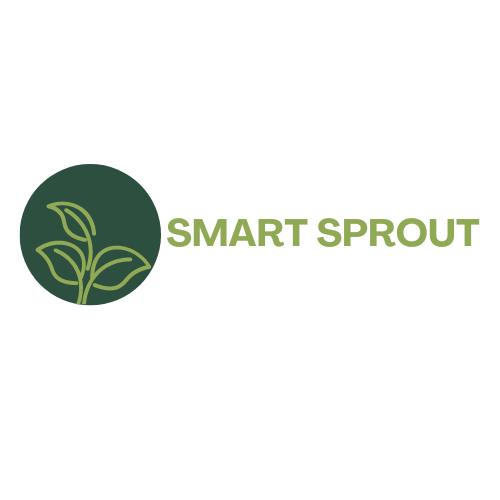

  
  
  # 🌱 **SmartSprout: Smart Home Garden System**  

   
  

---

## 👥 **Team Members**
| **Name**             | **Student ID** |
|-----------------------|----------------|
| Aditi Patel           | n01525570      |
| Birava Prajapati      | n01579924      |
| Darshan Prajapati     | n01584247      |
| Zeel Patel            | n01526282      |

---

## 🎯 **Project Objective**
The **SmartSprout Home-Garden System** simplifies and automates plant care, enabling users to manage their gardens seamlessly through a mobile application.  

### 🌟 **Core Goals**:
- Automate plant care tasks, such as watering.
- Provide **real-time sensor data** for informed decisions.
- Deliver customized **notifications and reminders**.
- Promote sustainable gardening practices.

🌼 With **SmartSprout**, gardening has never been easier or smarter!

---

## ✨ **Key Features**
✅ **User-Friendly Mobile App**:
- Add and manage plants with ease.  
- Access live data and submit feedback directly in the app.

✅ **Automation**:
- Set watering schedules and automate care tasks.  
- View sensor data in real-time (e.g., moisture, sunlight).

✅ **Smart Notifications**:
- Receive care reminders (e.g., watering, fertilizing).  
- Stay informed with Android notifications.

✅ **Cloud Integration**:
- Powered by **Firebase Authentication**, **Firestore**, and **Realtime Database** for secure data handling.

✅ **Offline Mode**:
- Critical features accessible even without internet connectivity.

---

## 🛠️ **Technology Stack**
| **Category**       | **Technology**                                  |
|---------------------|------------------------------------------------|
| **Mobile Development** | Android Studio, Java                         |
| **Cloud Services**      | Firebase Authentication, Firestore, Realtime DB |
| **APIs**               | Plant API                                   |
| **Version Control**     | GitHub                                     |

---

## 🚀 **How It Works**
1. **🌟 User Onboarding**:  
   Secure sign-up and log-in using Firebase Authentication.  
2. **🌱 Add Plants**:  
   Use the search feature to find and add plants via API.  
3. **📊 Monitor Garden**:  
   View real-time data for moisture, sunlight, and temperature.  
4. **🛠 Automate Tasks**:  
   Schedule care tasks and receive timely notifications.  
5. **📝 Feedback**:  
   Share feedback directly from the app for future improvements.

---

## 🛠️ **Upcoming Features**
- 🤖 **AI Integration**: Analyze plant health using AI-driven image recognition.  
- 🎙 **Voice Commands**: Enable hands-free garden management.  
- 📈 **Advanced Sensors**: Support for additional sensors and analytics.

---
